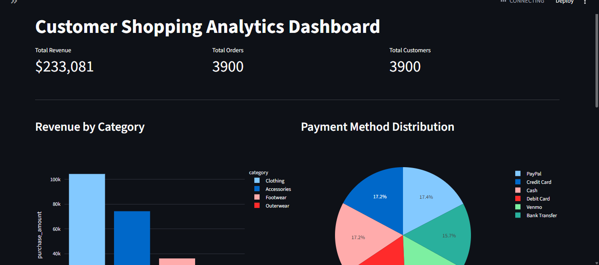
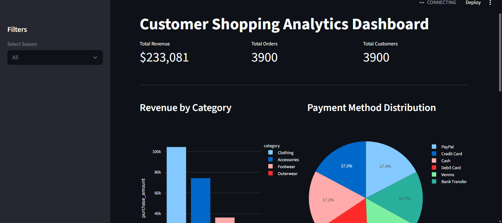
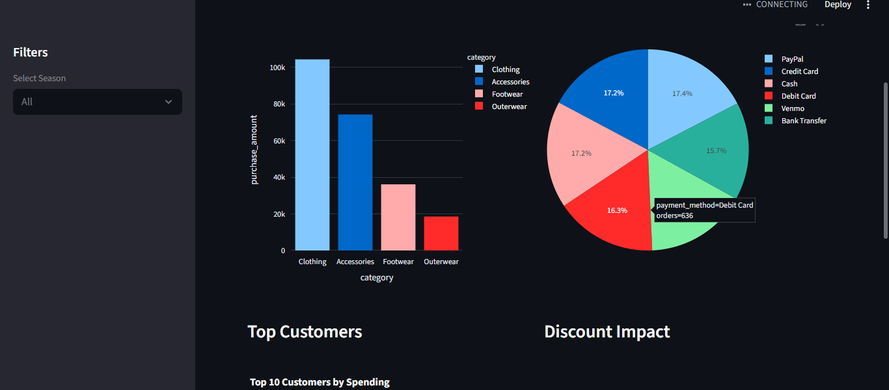
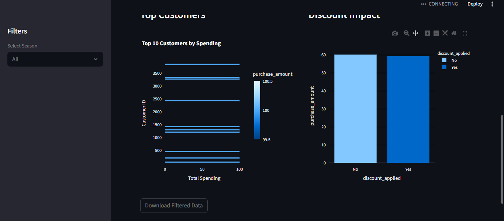

# E-Commerce Customer Shopping Behavior Analysis

## Project Overview

This project analyzes customer shopping behavior using **SQL, Python,
and Streamlit** to generate business insights from an e-commerce
dataset.

The goal is to simulate a real-world analytics workflow used by **Data
Analysts and Data Scientists**: - Data ingestion - Database design and
normalization - SQL-based analysis - Interactive dashboard for business
insights

Key questions answered: - Which product categories generate the most
revenue? - What payment methods are most commonly used? - Do discounts
influence purchasing behavior? - Who are the highest-value customers?

------------------------------------------------------------------------

# Tech Stack

  Tool        Purpose
  ----------- -----------------------------------
  MySQL       Database storage and SQL analysis
  Python      Data processing
  Pandas      Data cleaning and transformation
  Streamlit   Dashboard development
  Plotly      Interactive visualizations

------------------------------------------------------------------------

# Dataset

Customer Shopping Behavior Dataset 

Features include: - Customer ID - Gender - Age - Category - Purchase
Amount - Payment Method - Discount Applied - Season - Review Rating

------------------------------------------------------------------------

# Project Workflow

## 1. Data Ingestion

Dataset loaded using Python and Pandas, then
inserted into MySQL.

Example:

``` python
import pandas as pd
df = pd.read_csv("shopping_data.csv")
```

------------------------------------------------------------------------

## 2. Database Design (Normalization)

The raw dataset was normalized into multiple tables.

### Customers Table

-   customer_id
-   gender
-   age

### Products Table

-   product_id
-   category

### Purchases Table

-   purchase_id
-   customer_id
-   product_id
-   purchase_amount
-   payment_method
-   discount_applied
-   review_rating
-   season

------------------------------------------------------------------------

# SQL Analysis

### Total Revenue

``` sql
SELECT SUM(purchase_amount) AS total_revenue
FROM purchases;
```

### Revenue by Category

``` sql
SELECT category, SUM(purchase_amount) AS revenue
FROM purchases
JOIN products USING(product_id)
GROUP BY category
ORDER BY revenue DESC;
```

### Top Customers

``` sql
SELECT customer_id, SUM(purchase_amount) AS total_spent
FROM purchases
GROUP BY customer_id
ORDER BY total_spent DESC
LIMIT 10;
```

### Payment Method Distribution

``` sql
SELECT payment_method, COUNT(*) AS total_orders
FROM purchases
GROUP BY payment_method;
```

------------------------------------------------------------------------

# Dashboard

An interactive **Streamlit dashboard** was developed to visualize
business insights.

Dashboard features: - Revenue KPIs - Revenue by category - Payment
method distribution - Top customers - Discount impact analysis 

Filters: - Season 

------------------------------------------------------------------------

# Key Insights

Example insights: - A small percentage of customers generate a large
portion of revenue. - Certain product categories dominate overall
sales. - Discount strategies influence purchasing behavior. - Payment
method preferences vary across customers.

------------------------------------------------------------------------

# How to Run the Project

## Clone Repository

    git clone https://github.com/psawner/Customer-Shopping-Behavior-Analysis.git

## Install Dependencies

    pip install pandas streamlit plotly mysql-connector-python

## Run Dashboard

    streamlit run app.py

------------------------------------------------------------------------

# Dashboard Preview

### Dataset Analysis











--------------------------------------------------------------------------

# Project Structure

    ecommerce-sql-analysis
    │
    ├── data/
    │   └── customer_shopping_behavior.csv
    │   
    ├── assets/
    │   ├── dashboard1.png
    │   └── dashboard2.png
    │   
    ├── sql/
    │   ├── analysis_queries.sql
    │   ├── insert_data.sql
    │   └── schema.sql
    │
    ├── dashboard/
    │   └── app.py
    │
    ├── notebooks/
    │   └── cleaning.ipynb
    │
    └── README.md

------------------------------------------------------------------------

# Skills Demonstrated

-   SQL Querying
-   Database Design
-   Data Cleaning
-   Data Analysis
-   Data Visualization
-   Dashboard Development
-   Business Insight Generation

------------------------------------------------------------------------
